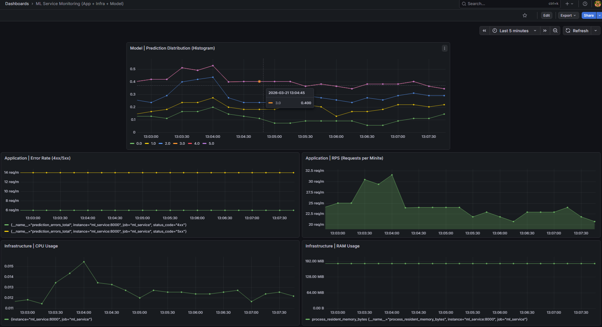

# Описание проекта

End‑to‑end ML‑проект по классификации ценовой категории смартфонов.  
Включает полный цикл: EDA → обучение и эксперименты в MLflow → выбор production‑модели → деплой FastAPI‑сервиса → мониторинг метрик в Prometheus и визуализация в Grafana.

**Что сделано:**
- подготовка и анализ данных (EDA),
- построение baseline‑модели и улучшение через feature engineering и feature selection,
- подбор гиперпараметров (Optuna),
- логирование экспериментов и регистрация модели в MLflow,
- production‑модель и REST‑сервис предсказаний,
- мониторинг запросов/ошибок/предсказаний и инфраструктурных метрик.

**Стек:**  
Python, pandas, scikit‑learn, FastAPI, MLflow, Prometheus, Grafana, Docker, Docker Compose.

# Лабораторная работа №1

## Настройка окружения и разведочный анализ данных (EDA)

## Описание проекта

Данный проект создан в рамках выполнения лабораторной работы №1 по
дисциплине **Интеллектуальные информационные системы**.

Цель работы - подготовить структуру проекта, настроить рабочее
окружение и провести **разведочный анализ данных (EDA)**.

В ходе выполнения лабораторной работы была создана структура проекта,
настроено виртуальное окружение Python, проведен анализ датасета и
построены графики, позволяющие выявить основные закономерности в данных.

Результаты данной работы будут использоваться в следующих лабораторных
работах для построения и обучения моделей машинного обучения.

------------------------------------------------------------------------

## Структура проекта

На текущем этапе структура проекта имеет следующий вид:

```
my_proj
|_____ .venv_my_proj           # виртуальное окружение
|_____ .git                    # локальный репозиторий
|_____ data                    # исходные и промежуточные данные
| |___ dataset.csv             # исходный датасет
| |___ clean_dataset.pkl       # очищенный датасет
|
|_____ eda                     # EDA
| |___ eda.ipynb               # разведочный анализ данных
|
|_____ images                  # скриншоты графиков и дашборда
| |___ Частота запросов в минуту.png
| |___ Количество запросов с ошибками 4xx и 5xx.png
| |___ Гистограмма предсказаний модели по bucket-интервалам.png
| |___ ml_dashboard.png
|
|_____ research                # исследования и MLflow
| |___ research.ipynb          # эксперименты по моделям
| |___ production_pipeline.ipynb  # финальный production pipeline
| |___ artifacts/              # списки признаков и артефакты
| |___ run.ps1                 # запуск MLflow
|
|__ services                   # продакшн-часть: сервисы и мониторинг
|  |__ ml_services             # сервис инференса (FastAPI)
|  |  |__ main.py              # точка входа FastAPI
|  |  |__ api_handler.py       # обработка данных и predict
|  |  |__ requirements.txt     # зависимости сервиса
|  |  |__ Dockerfile           # сборка образа ml_service
|  |
|  |__ requests                # генератор запросов к ml_service
|  |  |__ requests_sender.py   # скрипт отправки запросов
|  |  |__ requirements.txt     # зависимости генератора трафика
|  |  |__ Dockerfile           # сборка образа requests_service
|  |
|  |__ prometheus              # конфигурация Prometheus
|  |  |__ prometheus.yml       # jobs/targets (ml_service)
|  |
|  |__ grafana                 # файлы Grafana
|  |  |__ grafana.db           # база Grafana
|  |  |__ ml_dashboard.json    # экспортированный дашборд
|  |  |__ ...                  # служебные папки (csv, pdf, plugins, png)
|  |
|  |__ models                  # модель и скрипт загрузки
|  |  |__ get_model.py         # скрипт получения модели из MLflow
|  |  |__ model.pkl            # сериализованная production‑модель
|
|_____ services/compose.yml    # Docker Compose для всех сервисов
|_____ .gitignore
|_____ README.md
|_____ requirements.txt
```


------------------------------------------------------------------------

# Запуск проекта

Чтобы развернуть проект на другом компьютере:

## 1. Клонировать репозиторий

git clone https://github.com/AnoshkinDV/iis.git

## 2. Создать и активировать виртуальное окружение

python3 -m venv venv
source venv/bin/activate

## 3. Установить зависимости

pip install -r requirements.txt

## 4. Добавить датасет

Скопировать файл dataset.csv в папку:

data/

## 6. Запустить EDA

jupyter notebook eda/eda.ipynb

------------------------------------------------------------------------

# Разведочный анализ данных (EDA)

Используется датасет **Mobile Price Classification**.

Целевая переменная:

price_range --- ценовая категория мобильного устройства.

Датасет содержит характеристики мобильных телефонов:

-   RAM
-   battery_power
-   screen resolution
-   internal memory
-   CPU cores
-   другие аппаратные характеристики

------------------------------------------------------------------------

# Этапы анализа данных

## 1. Загрузка и знакомство с данными

Выполнено:

-   загрузка датасета
-   просмотр первых строк данных
-   анализ структуры данных
-   проверка типов данных
-   выделение числовых и категориальных признаков
-   анализ распределения целевой переменной

## 2. Очистка данных

На этапе очистки:

-   проверены пропущенные значения
-   проверены дубликаты
-   удалены некорректные значения

После очистки сформирован очищенный датасет:

data/clean_dataset.pkl

Формат pickle используется для сохранения типов данных.

## 3. Анализ признаков

Построены следующие графики:

1.  Распределение целевой переменной price_range
2.  Распределение признака RAM
3.  Зависимость RAM от price_range
4.  Корреляционная матрица признаков
5.  Scatter plot battery_power и RAM
6.  Интерактивный график RAM и battery_power

Графики сохранены в папке:

eda/

------------------------------------------------------------------------

# Основные выводы EDA

В ходе анализа выявлены следующие закономерности:

-   Целевая переменная price_range распределена достаточно равномерно
    между классами, что хорошо для обучения модели классификации.
-   Признак RAM является одним из наиболее значимых факторов, влияющих
    на ценовую категорию устройства.
-   С увеличением объема RAM возрастает вероятность принадлежности
    устройства к более высокому ценовому классу.
-   Признак battery_power распределен относительно равномерно и
    оказывает более слабое влияние на целевую переменную.
-   Корреляционная матрица показывает, что RAM имеет наиболее заметную
    связь с price_range.
-   Анализ scatter plot показывает, что комбинация признаков RAM и
    battery_power помогает лучше разделять классы.

------------------------------------------------------------------------

# Итог

В ходе выполнения лабораторной работы:

-   создана структура проекта
-   настроено виртуальное окружение
-   установлены необходимые библиотеки
-   проведен разведочный анализ данных
-   построены графики и выявлены зависимости

Полученные результаты будут использоваться в следующих лабораторных
работах.

------------------------------------------------------------------------

# Лабораторная работа №2  
## Настройка и исследование моделей машинного обучения

---

## Цель работы

Основная цель лабораторной работы №2 — провести исследования по настройке и подбору параметров моделей машинного обучения для улучшения качества предсказаний на подготовленном датасете.

---

## Задачи работы

- Изучить методы предварительной настройки и отбора гиперпараметров моделей.
- Провести настройку различных моделей с использованием выбранных критериев.
- Произвести отбор признаков по важности.
- Провести оценку качества моделей по метрикам.
- Сравнить результаты различных настроек и подобрать лучшую конфигурацию.

---

## Описание процесса

В рамках лабораторной работы был реализован полный цикл исследования моделей машинного обучения.

Основные этапы работы:

- Использован подготовленный и очищенный датасет мобильных устройств.
- Построена **baseline модель RandomForestClassifier**.
- Выполнен **feature engineering** с использованием инструментов `sklearn`.
- Проведён **отбор признаков с помощью SequentialFeatureSelector из библиотеки mlxtend**.
- Выполнен **подбор гиперпараметров модели RandomForestClassifier с использованием Optuna**.
- Все эксперименты, параметры моделей, метрики и артефакты были сохранены и проанализированы в **MLflow**.

---

## Результаты исследования

В ходе экспериментов были протестированы следующие конфигурации моделей:

1. Baseline RandomForestClassifier
2. RandomForest + Feature Engineering
3. RandomForest + Feature Engineering + Feature Selection (mlxtend SequentialFeatureSelector)
4. RandomForest + Optuna Hyperparameter Tuning

По результатам экспериментов лучшую метрику качества показала модель: sklearn_feature_engineering + mlxtend_forward_selection_random_forest


| Метрика | Значение |
|-------|-------|
| F1 weighted | ≈ 0.91 |
| Precision weighted | ≈ 0.91 |
| Recall weighted | ≈ 0.91 |
| ROC AUC OVR weighted | ≈ 0.99 |

## Используемая модель

RandomForestClassifier

## Параметры модели

n_estimators = 100
random_state = 42
n_jobs = -1

## Отобранные признаки

Финальная модель обучалась на признаках, полученных после этапа **feature engineering** и последующего **feature selection**.

Список признаков сохранён в файлах:

research/artifacts/selected_feature_names.txt
research/artifacts/production_feature_names.txt

Примеры выбранных признаков: ram
battery_power
px_height
px_width
int_memory
ram battery_power
battery_power^2
px_height_1.0
px_height_2.0
px_width_1.0
px_width_2.0
int_memory_1.0
int_memory_2.0

## Production модель

Финальная production модель обучена **на всей выборке данных** и зарегистрирована в **MLflow Model Registry**.

Название модели: mobile_price_classifier

Версия модели: Version 7

## Run ID production модели

Run ID прогона production модели: 8165633fb74d422da075b341cd030f41

## Для запуска mlflow выполнить

```
mlflow server `
    --backend-store-uri sqlite:///mlruns.db `
    --default-artifact-root ./mlartifacts `
    --host localhost `
    --port 5000
После запуска откроыть в браузере http://localhost:5000 для просмотра результатов.
```

------------------------------------------------------------------------

# Лабораторная работа №3  Создание сервиса предсказаний
---

## Описание сервиса

В рамках лабораторной работы №3 разработан REST-сервис для предсказания ценовой категории мобильного устройства на основе обученной модели машинного обучения.

Сервис реализован с использованием **FastAPI** и запускается внутри Docker-контейнера.

---

## Структура сервиса и описание файлов

Папка `services` содержит ключевые директории сервиса:

```
services/
│
├── ml_services/
│ ├── main.py # FastAPI приложение
│ ├── api_handler.py # обработчик запросов и работа с моделью
│ ├── Dockerfile # сборка docker-образа
│ ├── requirements.txt # зависимости сервиса
│
├── models/
│ ├── get_model.py # загрузка модели из MLflow
│ └── model.pkl # обученная production‑модель

```
Папка `services/ml_services` содержит код REST‑сервиса для инференса модели:

- `main.py` — FastAPI‑приложение с endpoint `/api/prediction`, описание входных полей, формирование данных для модели.  
- `api_handler.py` — загрузка модели из `services/models/model.pkl`, подготовка входных данных и предсказание.  
- `requirements.txt` — зависимости, необходимые для работы сервиса.  
- `Dockerfile` — сборка Docker‑образа и запуск Uvicorn.

Папка `services/models` содержит:
- `get_model.py` — скрипт загрузки модели из MLflow
- `model.pkl` — сериализованная production‑модель для сервиса

---

## Сборка Docker-образа

Перейти в директорию: services/ml_services

Выполнить команду:
```
docker build -t mobile_price_service:2 .
```

mobile_price_service — имя образа, 2 — версия образа

---

## Запуск контейнера
Из той же директории выполнить:

```
docker run -p 8000:8000 -v $(pwd)/../models:/models mobile_price_service:2
```
Параметры:

-p 8000:8000 — проброс порта контейнера на хост
-v $(pwd)/../models:/models — подключение модели внутрь контейнера

---

## Проверка работоспособности

Открыть в браузере Swagger-интерфейс FastAPI:

```
http://localhost:8000/docs
```
## Пример запроса:
```
POST /api/prediction?item_id=1
```
## Пример тела запроса:
```
{
  "battery_power": 1500,
  "blue": 1,
  "clock_speed": 2.0,
  "dual_sim": 1,
  "fc": 8,
  "four_g": 1,
  "int_memory": 32,
  "m_dep": 0.6,
  "mobile_wt": 140,
  "n_cores": 4,
  "pc": 12,
  "px_height": 1200,
  "px_width": 1000,
  "ram": 2048,
  "sc_h": 15,
  "sc_w": 8,
  "talk_time": 12,
  "three_g": 1,
  "touch_screen": 1,
  "wifi": 1
}
```

## Пример ответа:
```
{
  "item_id": 1,
  "predict": 2
}

```
---

# Лабораторная работа №4. Мониторинг сервиса предсказаний

В рамках ЛР4 добавлен стек мониторинга Prometheus + Grafana для сервиса предсказаний.  
Цель — собирать метрики работы сервиса и модели, визуализировать их на дашборде и анализировать поведение системы под нагрузкой.

## Используемые технологии
- Prometheus + prometheus_client — сбор и экспозиция метрик
- Grafana — визуализация метрик и дашборд
- Docker, Docker Compose — совместный запуск сервисов

## Сервисы мониторинга (services/)
- `prometheus/` — конфигурация Prometheus  
  Файл: `services/prometheus/prometheus.yml`  
  Веб‑интерфейс: http://localhost:9090
- `grafana/` — дашборды Grafana  
  Файл: `services/grafana/ml_dashboard.json`  
  Веб‑интерфейс: http://localhost:3000 (admin / admin)
- `requests/` — генератор трафика для ML‑сервиса (фоновые запросы для метрик)  

Сервисы БД и pgadmin в этой лабораторной работе не использовались, задания по БД не выполнялись (по условию допустимо).

## Запуск проекта (Docker Compose)

Из корня проекта:
```bash
docker compose -f services/compose.yml up --build -d
```

Остановка:
```bash
docker compose -f services/compose.yml down
```
Доступные сервисы:
- ML‑сервис: http://localhost:8000/docs
- Prometheus: http://localhost:9090
- Grafana: http://localhost:3000 (admin / admin)

---


## Метрики и мониторинг

Метрики сервиса доступны по `/metrics` и собираются Prometheus.

Примеры запросов:
- Частота запросов (RPS):  
  `sum(rate(prediction_requests_total[1m])) * 60`
- Ошибки 4xx / 5xx:  
  `sum(rate(prediction_errors_total{status_code="4xx"}[1m])) * 60`  
  `sum(rate(prediction_errors_total{status_code="5xx"}[1m])) * 60`
- Гистограмма предсказаний:  
  `sum(rate(prediction_value_histogram_bucket[1m])) by (le)`

### Скриншоты Prometheus
**Гистограмма предсказаний модели:**  


**Частота запросов в минуту:**  


**Ошибки 4xx и 5xx:**  


## Дашборд Grafana
Дашборд экспортирован в `services/grafana/ml_dashboard.json`.  
Содержит 5 панелей разных уровней мониторинга:

- `App | RPS (Requests per Minute)`
- `App | Errors 4xx/5xx per Minute`
- `Model | Prediction Distribution (Histogram)`
- `Infra | CPU Usage`
- `Infra | RAM Usage`

**Скриншот дашборда:**  


### Импорт/экспорт
Экспорт: Grafana → Dashboard settings → JSON model → Download JSON  
Импорт: Grafana → Dashboards → Import → Upload JSON file → `ml_dashboard.json`